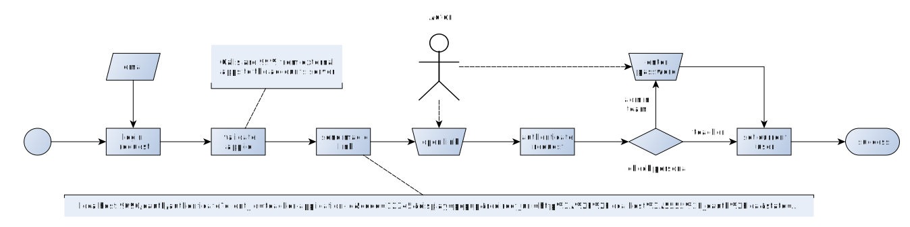

# Authenticating Users

User authentication is a crucial part of most applications.
The lea. system consists of several applications that should share the same user base. 
It is thus crucial to provide a working authentication across the applications that is intuitive and resistant 
to errors related to end-users.

Examples of end-user-related errors can be

- weak passwords, guessable passwords
- reused password-email combinations as used in other platforms
- leaked passwords (over the shoulder; written on paper)
- forgot password (causing frustration; causing password reset with weak password)
- leaving the service due to complex password policy
- general frustration due to multiple passwords

## Strategy

There should be a dedicated strategy in order to prevent password-related end-user errors.
It should fulfill a good compromise between the three factors

- security and risk measures
- usability and user experience
- feasibility and costs of implementation

### Validation of application

There needs to be an additional measure to validate the application from which the login attempt is made.
This includes the application-id and the secret that are required for the OAuth workflow.

Any login attempt that does not validate to be from one of the whitelisted applications
has to be denied.

### Passwordless login

Capability-based strategies ([OAuth](https://en.wikipedia.org/wiki/OAuth), [TOTP](https://en.wikipedia.org/wiki/Time-based_One-time_Password_algorithm)) have a fair risk measure as operations are only executed with a validated 
capability (token within expiration time-frame).

Still they can involve user-frustrating steps (passwords, second factor) or are expensive to implement (SMS based second
factor involves third party services, costs etc.)

The current best approach that combines fair security with a fair usability and a fair feasibility is to login
with a capability url (magic link) that is sent to the user via email (additional messengers could be investigated) and
which authenticates the user, once opened as it passes the OTP (one-time-password) to the server, which (if valid) logs
the user in.

- https://en.wikipedia.org/wiki/One-time_password
- https://en.wikipedia.org/wiki/Capability-based_security
- https://w3ctag.github.io/capability-urls/
- https://security.stackexchange.com/questions/118975/is-it-safe-to-include-an-api-key-in-a-requests-url

### Additional password for team members and administrators

Team members and administrators still have to provide their password in addition to the OTP in order
to authenticate.

## Overview

The following graphics summarizes the above described workflow:

## Further usages

Parts of the describes workflow can be leveraged for further usages. 
Operations that can have severe consequences could be implemented in a way, that they require an OTP to be send
via magic mail link and that only execute if the OTP matches.

These should be each defined in an own specification document. 
