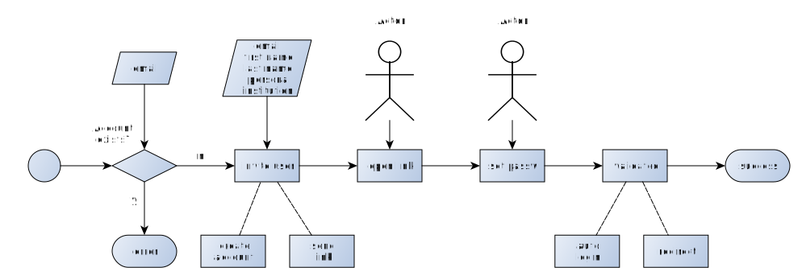

# Sepcification User Invitation

This specification is describing the process of inviting new users to the system.
The targeted users are

- new core team members (persona: `team`)
- new co-administrators (persona: `admin`)
- new instructors and teachers (persona: `teacher`)

This workflow differes from inviting participants because the above described user groups inhibit
certain privileges and require a stricter authentication than the code-based auth of participants.

## Invitation requirements

- There needs to be a role `inviteUsers` that permits to send invitations to users
- The invitation needs to be entered by a privileged request via
  - Form entry (a privileged user enters the invitation credentials manually via a form)
 - API request (there is a privileged / authorized request to a specific API with the 
   respective invitation credentials)
- The invitation schema requires at least the following data schema:
  - `email`, `firstName`, `lastName`, `role`, `institution` and (optional) `application` (id)
  - If application id is given: There needs to be a configured redirect url for the respective application id
   in order to redirect the invited user on successfull registration to the right application

## Invitation workflow

- The workflow starts with a request for an invitation
- If the parameters schema is incomplete or invalid, end by throwing an error 
- If an account exists by given `email`, end by throwing an error
- Else: The server creates a new user account with given credentials plus a random password
  - The server generates a default random (32-character long) password 
- The server assigns the given role to the new user account but keeps the account in an "invalid" status
- The server generates an expiration date by a given offset (in days) that it reads from the settings.json file
- The server sends to enrolment email to the given user
- The user opens the enrolment link and gets directed to the enrollment page
- The user is asked to change her password
- On successful password update the user automatically logged in
  - Optionally, the user is redirected to the defined application's redirect url

 